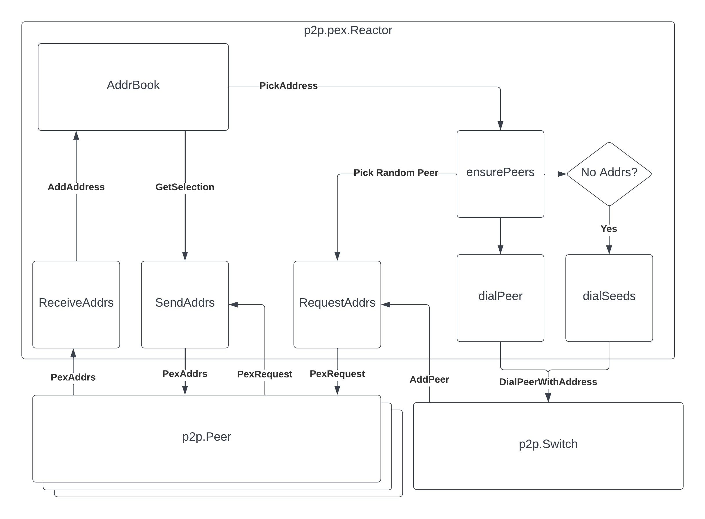

# Diagram: PEX Reactor

The diagram represents the interaction of the PEX reactor with the p2p layer,
more specifically with the `Switch` and multiple connected `Peer` instances.

The left side of the diagram represents the implementation of the Peer Exchange
(PEX) protocol, used by nodes to exchange known addresses of nodes.
The addresses known by each node are stored in an address book (the depicted
`AddrBook` instance).
Addresses received from peers in `PexAddrs` messages are added to the address book.
When a peer request addresses, using the `PexRequest` message, the node replies
with a (random) selection of addresses stored in its address book.

The right side of the diagram represents the implementation of a core component
of the p2p layer: the logic for establishing connections with new peers.
The main implementation block of this logic is the `ensurePeers` routine,
periodically executed (every 30s) by regular nodes.
When the logic defines that a node should establish new connections with peers,
the `ensurePeers` routine retrieves potential peer addresses from the address
book (using the depicted `PickAddress` method).
Some checks are performed regarding the obtained addresses, which are then
dialed using the `Switch.DialPeerWithAddress` method.
In the case when the logic defines that new connections should be established
but no suitable addresses are found in the address book, the node dials the
configured seed nodes.

As part of the PEX protocol logic, once an outbound connection is established
with a node, the node requests addresses to the new node.
New connections are reported to registered reactors via the depicted `AddrPeer`
method.
PEX requests are also periodically sent as part of the `ensurePeers` logic:
the node selects a connected peer at random and sends a `PexRequest` message to
that peer, as represented in the diagram.

Notice that those interactions are described in more detail in the part of the
p2p specification that documents the implementation of the p2p layer:
https://github.com/cometbft/cometbft/blob/main/spec/p2p/implementation/pex.md
