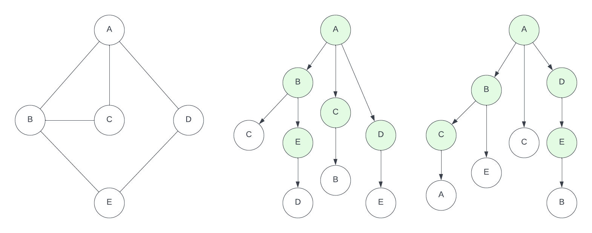

# Transaction flooding protocol

This document presents the abstract protocol adopted by CometBFT's mempool to
disseminate transactions in a network.
The presented transaction flooding protocol abstracts the peculiarities of the
mempool to focus on the approach for propagating transactions in a peer-to-peer
network, as a reliable broadcast protocol.
The goal is to analyse the message complexity for propagating transactions in
the mempool protocol.

## Pseudo-code

The pseudo-code below represents a simple reliable broadcast protocol.
The `brodcast(tx)` primitive is the entry point of the protocol; it is invoked by
clients to initiate the broadcast of a transaction `tx`.
The `deliver(tx)` primitive is the output of the protocol; it delivers
received transactions, which are added to the mempool.

```go
var peers // set of peers to which the node is connected
var seen  // set of transactions already seen, initially empty

upon brodcast(tx):
    if tx not in seen
        add tx to seen
        deliver(tx) // Add to the mempool
        for all q in peers
            send <tx> to q

upon receive <tx> from s:
    if tx not in seen
        add tx to seen
        deliver(tx) // Add to the mempool
        for all q in peers \ {s}
            send <tx> to q
```

The protocol operates in a peer-to-peer (p2p) network, in which each node is
directly connected to a set of `peers`.
The `peers` set is managed by the underlying p2p communication layer, which can
add new peers, as connections are established, or remove existing peers, when
existing connections are dropped.

Transactions are disseminated by flooding, as the node sends every transaction
it receives to all its `peers`.
A transaction can be received via the `broadcast(tx)` primitive or via the
network unicast `receive` primitive.
In the case of transactions received from the network, the node does not send
the transaction back to the node `s` from which the transaction was received.
The messages `<tx>` exchanged by nodes encode a transaction.

The `seen` set is used in the pseudo-code to determine whether a transaction is
received for the first time.
A transaction can be received by a node multiple times, but it should only be
delivered and sent to peers once.
The adoption of the `seen` set thus provides a simple mechanism to cease the
propagation of transactions.

## Propagation graph

The operation of the transaction flooding protocol when disseminating a
transaction `tx` can be represented by a propagation graph,
a directed graph with sets of vertices and links defined as follows:

- Vertices are tuples `(p, s, t)` and represent the execution at node `p` of
  the step `s` of the protocol at a reference time `t`.
  Steps correspond to the pseudo-code `broadcast(tx)` or `receive <tx>` upon clauses.
- Links represent the sending of a message between two nodes and correspond to
  pseudo-code `send <tx>` primitives.
  A link connects a `broadcast(tx)` or `receive <tx>` step at a node `p` to a
  `receive <tx>` step at node `q` when the protocol defines that `p` at that
   step should send a `<tx>` message to its peer `q`.

The inclusion of the reference time `t` to label a vertex of the propagation
graph has two goals.
The first is to render vertices unique, since the same node `p` can execute
the same step `s` (e.g., `receive <tx>`) multiple times.
The second reason is to determine the _first time_ at which a step of the
protocol is executed by a node, which is relevant because a node only take
actions regarding a transaction the first time it is received.

The picture below provides two examples of propagation graphs for a network
with five nodes.
The undirected graph on the left represents the connections between the nodes,
thus the content of the `peers` set for each of the nodes.
For instance, node `A` has `{B, C, D}` as its peers,
while node `D` has `{A, E}` as peers.



The two directed graphs are propagation graphs representing two distinct
executions of the protocol.
Notice that the vertices `(p, s, t)` are labeled only with the node identifier
`p` $\in$ `{A, B, C, D, E}`.
The protocol step `s` of a vertex is not depicted but it can be derived:
vertices without inbound links, such as the root `A`, represent the
`broadcast(tx)` step,
while vertices with inbound links represent the `receive <tx>` step.
The reference time `t`, also not depicted on the graphs, is assumed to increase
from top to bottom.

## Analysis

The message complexity of the transaction dissemination protocol is determined
by the overlay network atop which the protocol is executed.
More specifically, it depends on the size of the `peers` set of each node of
the network, which corresponds to the `degree(p)` of each node `p` in the
overlay network graph.

A second aspect to be considered is how each node receives a transaction `tx`
for the first time:

1. if the `broadcast(tx)` clause of the pseudo-code is the first to be activated
  for a transaction `tx`, a node `p` sends the transaction to all its `peers`.
  The node thus sends `degree(p)` messages containing `tx`.
  The node `A` above illustrated is an example of this case, sending
  messages to `{B, C, D}`.
1. if the `receive <tx>` clause of the pseudo-code is the first to be activated
  for a transaction `tx`, a node `p` sends the transaction to all its `peers`
  but the peer from which the `<tx>` message was received.
  The node thus sends `degree(p) - 1` messages containing `tx`.
  The node `B` above illustrated is an example of this case: it receives the
  transaction from node `A` and forwards it in messages  to nodes`{C, E}`.

Observe that once one of the two clauses of the pseudo-code are activated for a
transaction `tx`, no further actions are taken if the same transaction `tx` is
received again.
This is illustrated in the figure above, where the highlighted nodes of the
propagation graphs represent the activation of a clause for a node.

Let `G(V, E)` be the network overlay graph where the protocol is running.
Lets partition the set of nodes `V` into two groups: `Bcast` contains nodes that
first activate `broadcast(tx)`,
and `Recv` contains nodes that first activate `receive <tx>`.
The number of messages exchanged by the protocol on `G` is then defined by:

$$
messages = \sum_{p \in Bcast} degree(p) + \sum_{p \in Recv} (degree(p) - 1)
= \sum_{p \in V} degree(p) - |Recv|
= 2|E| - |Recv|
$$

The sum of the degrees of all nodes in a graph is equal to two times the number
of edges in the graph (`|E|`), as each edge counts for the degree of both its ends.
The first part of the equation indicates that, in general, every link of the
overlay network graph is traversed by two messages carrying `tx`, one on each
direction.
The exception for this role are the links through which a node in the `Recv`
set receives the message carrying `tx` for the first time.
Since nodes receiving a transaction from a peer do not send the same message
back to this peer, those edges are only traversed by a single message carrying
the transaction `tx`.

The above equation is valid for the propagation graphs above depicted.
The overlay network graph contains $5$ nodes and $6$ links between nodes.
Every node except `A` is on the `Recv` set, which has size $4$.
The number of links and of messages exchanged in the two illustrated
propagation graphs is therefore $2*6 - 4 = 8$.

The above equation uses the size of the set `Recv` as parameter.
However, in most executions and networks a single node, or at least few nodes,
should start the broadcast of a transaction via `broadcast(tx)`.
This means that most nodes are in the `Recv` set,
namely $|Recv| \approx |V|$, from which the equation becomes:

$$
messages = 2|E| - |V| + |Bcast| \approx 2|E| - |V|
$$

For reference, in order to propagate a transaction in any connected graph with
`|V|` nodes, at least `|V| - 1` messages have to be exchanged.
The rationale is that every node in `V`, except the node that has initiated the
broadcast of the transaction, receives a single message carrying the transaction.
This message complexity is achieved by the transaction flooding protocol
provided that is run in an overlay network which is a _tree graph_.
A tree is a connected graph with no loops, which has `|E| = |V| - 1`,
thus leading to this optimal message complexity, which means no redundancy at
all, namely no node receives a transaction more than once.
