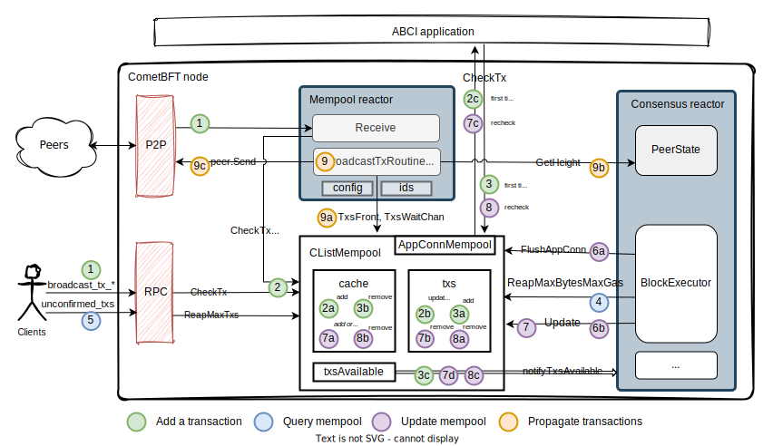

# Mempool implementation (WIP)

This document describes the implementation of the mempool in CometBFT v0.38.x,
the one called v0, that is, the simple implementation of the mempool as a queue
of transactions over a simple push-based gossip protocol.

## Main actions from and onto the mempool
### Add a transaction to the mempool

1. The mempool receives transactions either from two sources. Each transaction
   is checked individually with [`CheckTx`][CheckTx].
    
    - A client sends one transaction via broadcast_tx_* RPC endpoints. 
        [[`rpc.core.mempool.broadcast_tx_*`][broadcast_tx_*]]
        <!-- [spec:CheckTxRPC] -->
    
    - A peer sends a list of transactions via the P2P layer.
        [[`mempool.Reactor.Receive`][Receive]]
        <!-- [spec:P2P_ReceiveTxs] -->

2. Process incoming transaction to check its validity. 
    [[`mempool.CListMempool.CheckTx`][CheckTx]]
    <!-- [spec:CheckTxRPC_] -->
    
    2a. If the transaction is not in the cache, add it; otherwise ignore it.
    
    2b. If the transaction is in the mempool, update the list of senders.
    
    2c. Send a `CheckTx` ABCI request to the application.

3. On `CheckTx` response.
    [[`mempool.CListMempool.resCbFirstTime`][resCbFirstTime]]
    <!-- [spec:ReceiveCheckTxResponse] -->
    
    3a. If the transaction is valid, add it to mempool and record its sender.
    
    3b. If the transaction is valid but the mempool is full, or if the the
    transaction is invalid, then remove it from cache.

    3c. Notify Consensus that there is one transaction available.
        [[`mempool.CListMempool.notifyTxsAvailable`][notifyTxsAvailable]]

### Query transactions in the mempool

4. Consensus reactor reads mempool to create a proposal block.
    [[`state.BlockExecutor.CreateProposalBlock`][CreateProposalBlock]]

5. Get a list of unconfirmed transactions in the mempool, with a maximum number
    of entries. [[`rpc.core.mempool.unconfirmed_txs`][unconfirmed_txs]]

### Update transactions in the mempool

6. BlockExecutor updates the mempool after committing a block.
    [[`state.BlockExecutor.Commit`][Commit]]

    6a. Flush to ensure all async requests have completed in the ABCI app before
        commit. [[`mempool.CListMempool.FlushAppConn`][FlushAppConn]]
    
    6b. Call mempool's `Update` for all transactions in the block. 

7. Update the mempool. [[`mempool.CListMempool.Update`][Update]]
    <!-- [spec:Consensus_Update] -->

    7a. If a transaction is valid, put it in the cache (in case it was missing);
    otherwise, remove it from the cache, to give it a chance to be resubmitted
    later.

    7b. Remove from the mempool each transaction in the block.

    7c. If there are still transactions in the mempool and `config.Recheck` is
    true, then send one `CheckTx` ABCI request to the app for every transaction
    in the block. [[`mempool.CListMempool.recheckTxs`][recheckTxs]]
    
    7d. If there are still transactions in the mempool and `config.Recheck` is
    false, then notify Consensus that there are transactions available.
        [[`mempool.CListMempool.notifyTxsAvailable`][notifyTxsAvailable]]

8. On `CheckTx` response, if the transaction is invalid.
    [[`mempool.CListMempool.resCbRecheck`][resCbRecheck]]
    <!-- [spec:ReceiveRecheckTxResponse] -->
    
    8a. Remove it from the mempool.
    
    8b. Remove it from the cache.

    8c. If there are still transactions in the mempool, notify Consensus.
        [[`mempool.CListMempool.notifyTxsAvailable`][notifyTxsAvailable]]

### Propagate validated transactions to peers

9. Propagate each transaction in the mempool to all peers.
    [[`mempool.Reactor.broadcastTxRoutine`][broadcastTxRoutine]]
    <!-- [spec:P2P_SendTx] -->

    9a. Loop through the mempool.
        [[`mempool.CListMempool.TxsFront/TxsWaitChan`][txs-loop]]

    9b. Make sure the peer is up to date; then get its height.
        [[`peer.Get(types.PeerStateKey).(PeerState)`][Peer.Get]]
      - If we suspect that the peer is lagging behind, wait some time before
        checking again if the peer has caught up. See
        [RFC-103](https://github.com/cometbft/cometbft/blob/main/docs/rfc/rfc-103-incoming-txs-when-catching-up.md)

    9c. Send all transactions in the mempool to the peer, one by one.

## Links to code
### RPC
- [broadcast_tx_*]
- [unconfirmed_txs]

### Mempool reactor
- [Receive]
- [broadcastTxRoutine]

### CListMempool
- [CheckTx]
- [Update]
- [TxsFront/TxsWaitChan][txs-loop]
- [FlushAppConn]
- [resCbFirstTime]
- [resCbRecheck]
- [recheckTxs]
- [notifyTxsAvailable]

### Consensus
- [CreateProposalBlock]
- [Commit]
- [PeerState]

### Peer

- [Peer.Get]

[broadcast_tx_*]: https://github.com/cometbft/cometbft/blob/v0.38.x/rpc/core/mempool.go#L22-L144
[unconfirmed_txs]: https://github.com/cometbft/cometbft/blob/v0.38.x/rpc/core/mempool.go#L149

[Receive]: https://github.com/cometbft/cometbft/blob/v0.38.x/mempool/reactor.go#L93
[broadcastTxRoutine]: https://github.com/cometbft/cometbft/blob/v0.38.x/mempool/reactor.go#L132

[FlushAppConn]: https://github.com/cometbft/cometbft/blob/v0.38.x/mempool/clist_mempool.go#L153
[txs-loop]: https://github.com/cometbft/cometbft/blob/v0.38.x/mempool/clist_mempool.go#L176-L192
[CheckTx]: https://github.com/cometbft/cometbft/blob/v0.38.x/mempool/clist_mempool.go#L202
[resCbFirstTime]: https://github.com/cometbft/cometbft/blob/v0.38.x/mempool/clist_mempool.go#L369
[resCbRecheck]: https://github.com/cometbft/cometbft/blob/v0.38.x/mempool/clist_mempool.go#L432
[notifyTxsAvailable]: https://github.com/cometbft/cometbft/blob/v0.38.x/mempool/clist_mempool.go#L504
[Update]: https://github.com/cometbft/cometbft/blob/v0.38.x/mempool/clist_mempool.go#L577
[recheckTxs]: https://github.com/cometbft/cometbft/blob/v0.38.x/mempool/clist_mempool.go#L641

[CreateProposalBlock]: https://github.com/cometbft/cometbft/blob/v0.38.x/state/execution.go#L101
[Commit]: https://github.com/cometbft/cometbft/blob/v0.38.x/state/execution.go#L351
[PeerState]: https://github.com/cometbft/cometbft/blob/v0.38.x/consensus/reactor.go#L1021

[Peer.Get]: https://github.com/CometBFT/cometbft/blob/v0.38.x/p2p/peer.go#L44