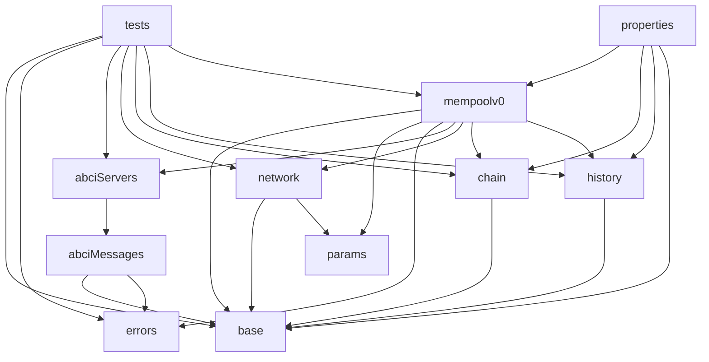

## Module dependency graph

```mermaid
flowchart TB
    tests --> base & errors & abciServers & network & chain & history & mempoolv0
    mempoolv0 --> base & params & errors & abciServers & network & chain & history
    abciServers --> abciMessages --> base & errors
    chain --> base
    history --> base
    network --> base & params
    properties --> mempoolv0 & chain & history & base
```
