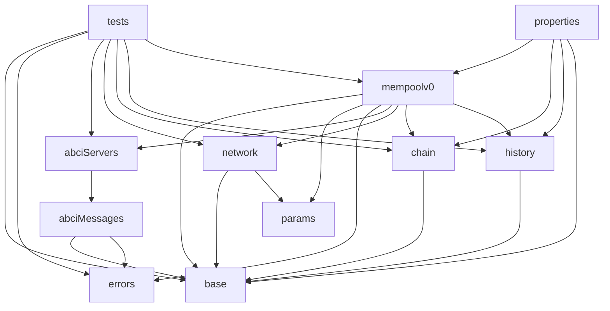

# Spec of mempool: v0 implementation, with cache

[Quint](https://github.com/informalsystems/quint/) specification of the
mempool's implementation called v0 as of `v0.38.0-rc1`. In particular, this
model includes the cache and it follows the code as close as possible so as to
be ready to apply [model-based testing](https://mbt.informal.systems/) in the
future.

## Tests and traces

For running all the tests:

    make test

For generating traces:

    make traces

By default it will generate traces whose final state has the property
`FullChain`, defined in module `mempoolv0`, that is, a state in which all
available transactions are included in the chain.

For generating traces for a specific property, you need to pass the negation of
that property (for example, `notFullChain`) as follows:

    PROP=<name-of-negated-property> make traces 

## Modules

The main module is `mempoolv0`. Other important modules are the following:
- `tests`: runs with different test scenarios executed with `make test`.
- `properties`: mempool high-level properties.
- `network`: keep track of messages sent through the P2P network.
- `abciServers`: ABCI application for each node, taking request messages and creating responses.
- `chain`: model of the blockchain, populated by the module Block Executor of the consensus reactor.
- `history`: history variables needed for expressing high-level properties.

The model parameters are defined in `base`. The rest is boilerplate.
### Module dependency graph

